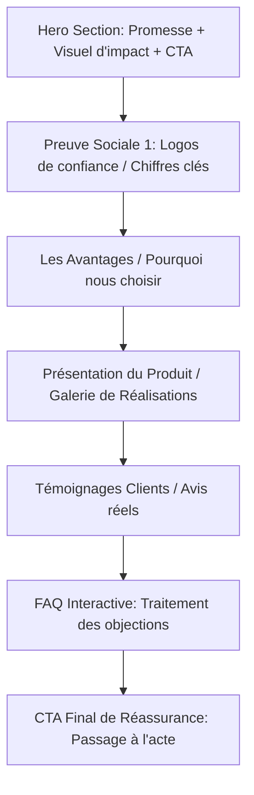

# Cadre de Cocréation de Landing Pages Premium 🚀

Ce document sert de **plan directeur (blueprint)** et de guide de brainstorming interactif. Vous pouvez l'utiliser à chaque fois que vous démarrez un nouveau projet de landing page pour un client. Copiez ce questionnaire dans notre chat pour structurer instantanément la conception graphique, la charte visuelle, et la technique.

---

## 📋 Étape 1 : Le Brief Client & Brainstorming
*Répondez à ces questions avant de commencer tout code ou design.*

### 1. Profil du Client & Cible
*   **Nom du client / de l'entreprise :**
*   **Secteur d'activité :**
*   **Qui est le client idéal (Persona) ?** (ex. jeunes professionnels, parents, PME, etc.)
*   **Quel problème majeur ce produit/service résout-il ?**

### 2. Objectifs de Conversion (Le But Unique)
*Une bonne landing page n'a **qu'un seul objectif principal**. Quel est-il ?*
*   [ ] Inscription à une formation / un webinaire
*   [ ] Prise de rendez-vous (Calendly, etc.)
*   [ ] Achat direct d'un produit/service
*   [ ] Téléchargement d'un aimant à prospects (Ebook, PDF)
*   [ ] Prise de contact directe via WhatsApp / Téléphone

### 3. La Proposition de Valeur Unique (USP)
*   **Pourquoi le visiteur doit-il choisir ce client plutôt qu'un concurrent ?**
*   **Quelle est la promesse principale en une phrase accrocheuse ?**

---

## 🎨 Étape 2 : Charte Graphique & Esthétique Visuelle
*Définissons ensemble le style visuel de la landing page pour un rendu "Premium".*

| Élément | Options recommandées | Choix du projet |
| :--- | :--- | :--- |
| **Style de design** | Minimaliste, Tech/Futuriste, Chaleureux/Organique, Corporatif épuré | |
| **Palette de couleurs** | *Primaire (Dominante 60%), Secondaire (Texte/Structure 30%), Accent (Boutons/CTA 10%)* | |
| **Typographie** | *Google Fonts sans-serif modernes (Inter, Outfit, Montserrat) ou Serif élégantes (Playfair Display)* | |
| **Ambiance** | Mode sombre (Dark mode premium), Mode clair lumineux, Glassmorphisme | |

> [!TIP]
> **Règle des 60-30-10** : 60% de la page doit être composée de la couleur dominante neutre (fond), 30% de la couleur de structure/texte, et 10% d'une couleur d'accent vive (orange, brique, turquoise) réservée **uniquement** aux boutons d'appel à l'action (CTA) pour attirer le regard.

---

## 📐 Étape 3 : Structure de Page Standard (Haute Conversion)
*Voici la structure idéale pour guider le visiteur vers l'action de manière naturelle.*

### 1. Section Hero (Au-dessus de la ligne de flottaison)
*   **Titre principal (H1)** : Une phrase percutante axée sur le bénéfice client.
*   **Sous-titre** : Explique brièvement *comment* la promesse est tenue.
*   **Bouton d'action (CTA)** : Très visible, contrasté, avec un verbe d'action clair (ex: "Obtenir mon accès libre").
*   **Élément visuel** : Image de haute qualité (générée ou réelle) ou courte vidéo explicative.

### 2. Preuve Sociale Directe
*   Logos de partenaires, mentions presse ou bande défilante avec des statistiques fortes (ex: "+150 projets livrés", "99% de clients satisfaits").

### 3. Les Bénéfices Majeurs (3 à 4 blocs max)
*   Ne listez pas seulement les caractéristiques techniques, mais **ce que le client y gagne** (ex: au lieu de "Support 24/7", écrivez "Ne soyez plus jamais bloqué").

### 4. Galerie / Démo (Section Visuelle Dynamique)
*   Images ou vidéos des réalisations, captures d'écran du produit ou démonstration interactive avec des effets de transition fluides.

### 5. Témoignages (Social Proof)
*   Avis clients avec photos, noms et fonctions. Les témoignages vidéo ou captures d'écran de messages réels convertissent encore mieux.

### 6. FAQ (Foire Aux Questions)
*   3 à 5 questions fréquentes pour désamorcer les dernières hésitations du visiteur (ex. tarifs, délais, garanties).

### 7. Pied de page & CTA Final
*   Un rappel simple de l'action principale pour éviter que le visiteur n'ait à remonter tout en haut de la page.

---

## ⚡ Étape 4 : Critères de Performance & UX Premium
*Pour chaque page créée, nous devons valider ces points techniques :*

*   [ ] **Mobile First** : Plus de 70% du trafic proviendra de smartphones. La mise en page doit être irréprochable sur mobile.
*   [ ] **Micro-animations** : Ajouter de légères animations au survol des boutons (scale, shadow) et à l'apparition des sections (fade-in scroll) pour rendre le site "vivant".
*   [ ] **Vitesse de chargement** : Compresser toutes les images au format `.webp` ou utiliser des CDN, différer le chargement des scripts non critiques.
*   [ ] **SEO de base** : Balise Title descriptive, Meta-description attrayante, structure sémantique propre (`h1`, `h2`, `section`, `header`, `footer`).

---

## 🤝 Étape 5 : Protocole de Brainstorming avec l'IA
*Comment utiliser ce document avec moi pour votre prochain client :*

1. **Copiez le questionnaire de l'Étape 1** complété avec les informations de votre client.
2. Nous analyserons ensemble la charte visuelle (**Étape 2**). Je vous proposerai des palettes de couleurs adaptées et une typographie assortie.
3. Je vous concevrai une structure de composants sur-mesure basée sur l'**Étape 3**.
4. Nous développerons la landing page de manière itérative (d'abord la structure globale, puis le design système, les sections et enfin les finitions d'animations).
